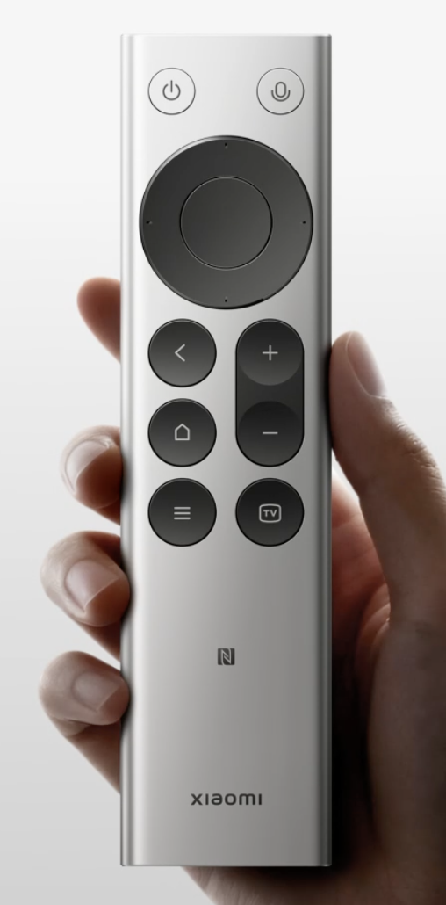

# Open Voice Bridge · 开放语音桥

Open Voice Bridge 是一个面向无线麦克风、语音遥控器和其他语音/按键外设的跨设备、跨传输、跨平台桥接框架。

它把问题拆成六层：设备身份与能力、传输、设备协议、音频图、动作映射和平台后端。一个设备可以组合 BLE GATT、Bluetooth HID、USB 数字音频或系统音频输入；macOS、Windows、Linux 分别实现自己的权限与 I/O 后端。

> 当前唯一已完成实现和真机验收的组合是：**Xiaomi Bluetooth Remote 2 Pro / RC003 + macOS**。Windows、Linux 和 DJI Mic 2 仍是 planned/research，不应理解为已经支持。

## 当前支持矩阵

| 设备 | macOS | Windows | Linux | 主要传输 |
| --- | --- | --- | --- | --- |
| Xiaomi RC003 | 已实现并真机验收 | 计划中 | 计划中 | BLE GATT（ATVV 语音）+ Bluetooth HID（按键） |
| DJI Mic 2 | 调研中 | 调研中 | 调研中 | 优先研究接收器 USB-C 数字音频；桌面蓝牙不作先验承诺 |
| 其他语音外设 | 通过 device profile 接入 | 通过 platform backend 接入 | 通过 platform backend 接入 | 以真实设备枚举和协议证据为准 |

DJI 官方说明 Mic 2 接收器可以通过 USB-C 连接电脑；其发射器直接蓝牙兼容列表主要包含指定 DJI 设备与手机。因此本项目不会因为设备“支持蓝牙”就把它假设为桌面通用蓝牙麦克风。相关资料见 [DJI Mic 2 Specs](https://www.dji.com/mic-2/specs) 和 [DJI Mic 2 FAQ](https://www.dji.com/mic-2/faq)。

## 框架入口

- [总体架构](docs/ARCHITECTURE.md)
- [添加新设备适配器](docs/ADDING_A_DEVICE.md)
- [设备 profile Schema](specs/device-profile.schema.json)
- [已实现的 Xiaomi RC003 profile](device-profiles/xiaomi-rc003.json)
- [DJI Mic 2 调研 profile](device-profiles/dji-mic-2.json)

Profile 只记录可核对的事实与状态，不是驱动。只有代码、自动验证和目标平台真机门都通过后，某个设备/平台组合才会标为 `implemented`。

## 第一个适配器：Xiaomi RC003 for macOS

现有 `XiaomiRemoteBridgeMac` target、应用显示名和 Bundle ID 暂时保留，避免总项目改名导致已安装用户重新授予蓝牙、输入监控和辅助功能权限。历史 [v0.2.0 测试版](https://github.com/nijez/open-voice-bridge/releases/tag/v0.2.0) 继续代表这个设备专用适配器。

当前功能：

- 精确发现、连接和重连 RC003；
- Android TV Voice-over-BLE（ATVV）能力协商与 16 kHz IMA/DVI ADPCM 解码；
- 把语音写入用户选择的 CoreAudio 输出，配合 BlackHole 等回环设备作为虚拟麦克风；
- 仅对 RC003 把真实 F5 硬件按下/松开映射为 Mac Fn/🌐︎，退出时恢复原映射；
- IOHID 原始按键读取，以及方向、确定、返回、主页、菜单、TV、音量等动作映射；
- 保持原比例的 RC003 实物图与图形化映射设置。

### 遥控器实物图与按键映射

<p align="center">
  
</p>

<p align="center"><sub>这是应用“按键”页面实际使用的原比例映射底图；图中音量只有 + 和 −，遥控器没有独立静音实体键。</sub></p>

打开菜单栏中的应用图标，选择“打开设置… → 按键”，即可使用图形化映射：

1. 打开“启用 RC003 自定义按键映射”；
2. 点击左侧实物图上的按键，右侧会自动定位到对应映射；
3. 从动作菜单中选择新动作，修改后自动保存；
4. 需要撤销所有自定义设置时，点击“恢复默认”。

麦克风键固定用于 **RC003 语音 + Mac Fn/🌐︎ 长按**，不参与普通按键下拉映射。遥控器没有独立静音实体键；“系统静音”只是可分配给其他实体键的可选动作，不是默认映射。

默认映射如下：

| 遥控器按键 | 默认 macOS 动作 |
| --- | --- |
| 麦克风 | 固定 RC003 语音 + Fn/🌐︎（按住开始，松开结束） |
| 电源 | Escape |
| 上 / 下 / 左 / 右 | 对应方向键 |
| 确定（OK） | Return |
| 返回 | Delete（退格） |
| 音量 + | 系统音量 + |
| 音量 − | 系统音量 − |
| 主页 | 显示桌面（Fn-F11） |
| 菜单 | Shift-F10 |
| TV | Command-Tab |

### 下载安装与首次配置

#### 1. 准备条件

- macOS 11 Big Sur 或以上；
- Apple Silicon 或 Intel Mac；
- 小米蓝牙遥控器 2 Pro / RC003；
- 使用遥控器语音时，安装 [BlackHole 2ch](https://existential.audio/blackhole/) 或等价的 CoreAudio 回环设备。

应用不会自动安装音频驱动，也不会修改系统默认输入/输出设备。

#### 2. 下载并安装应用

1. 从 [v0.2.0 测试版 Release](https://github.com/nijez/open-voice-bridge/releases/tag/v0.2.0) 下载 `xiaomi-remote-bridge-mac-0.2.0.dmg`；
2. 打开 DMG，把“小米遥控器桥接.app”拖到旁边的 `Applications`；
3. 进入“应用程序”，按住 Control 单击“小米遥控器桥接”，选择“打开”；
4. 如果系统仍然拦截：
   - macOS 13 或以上：进入“系统设置 → 隐私与安全性”，在安全性提示处选择“仍要打开”；
   - macOS 11/12：进入“系统偏好设置 → 安全性与隐私 → 通用”，选择“仍要打开”。

当前测试包使用 ad-hoc 签名，尚无 Apple Developer ID 签名和公证。只应从本项目 Release 或你信任的分享者处取得安装包。

#### 3. 让遥控器进入配对状态

1. 打开 Mac 的蓝牙设置；
2. 同时长按遥控器的 **主页键 + 菜单键**，让遥控器进入配对广播状态；
3. 在 Mac 上连接并允许名称为“小米蓝牙语音遥控器”、“MI RC”或“Xiaomi Bluetooth Remote 2 Pro”的设备；
4. 打开应用菜单栏图标；如果没有自动连接，选择“立即重新连接”。

#### 4. 授予按键映射权限

蓝牙权限用于连接 RC003 和读取语音；自定义按键还需要“输入监控”和“辅助功能”。在应用“打开设置… → 权限”中依次点击对应的“请求权限”：

- macOS 13 或以上：“系统设置 → 隐私与安全性 → 输入监控 / 辅助功能”；
- macOS 11/12：“系统偏好设置 → 安全性与隐私 → 隐私 → 输入监控 / 辅助功能”。

在两个列表中都打开“小米遥控器桥接”。如果列表里没有应用，先回到应用的“权限”页面重新点击“请求权限”，或使用列表下方的 `+` 手动加入 `/Applications/小米遥控器桥接.app`。完成后从菜单栏选择“退出”，再从“应用程序”重新打开一次。

#### 5. 配置 BlackHole 语音链路

1. 安装 [BlackHole 2ch](https://existential.audio/blackhole/)；
2. 打开“设置 → 连接”，在“虚拟麦克风 → 语音输出”中选择 `BlackHole 2ch`；
3. 可先点击“发送 1 秒测试音”，确认应用能够写入所选设备；
4. 在豆包输入法、微信输入法或其他目标语音应用中，把麦克风也选择为同一个 `BlackHole 2ch`；
5. 先单击目标输入框，确认文字光标已经出现；
6. 按住遥控器麦克风键说话，松开后应用会释放 Fn 并结束语音流。

#### 6. 验证按键与语音

- 方向、OK、返回、主页、菜单、TV、音量 +/− 应按上表执行；
- 打开“设置 → 按键”可以点击实物图并逐键修改；
- 长按麦克风键时开始语音，松开后应立即结束；
- 按键无映射反应时，先确认“输入监控”和“辅助功能”均已打开，并完全退出后重新启动应用。

### 常见问题

- **应用打不开**：使用 Control 单击“打开”；仍被拦截时，到对应系统版本的“安全性”页面选择“仍要打开”。
- **权限列表里没有应用**：先在应用“权限”页面点击“请求权限”；仍未出现时，用权限列表下方的 `+` 加入 `/Applications/小米遥控器桥接.app`，然后完全退出并重新打开。
- **遥控器按键有效但语音没有声音**：确认应用“语音输出”和目标输入法“麦克风”都选择了同一个 `BlackHole 2ch`，不要只选择 MacBook 自带麦克风。
- **豆包只显示绿色文字预览、只能复制**：这通常表示输入法没有取得当前可编辑输入框。松开按键，重新单击输入框确认光标后再试；如果电脑实体 Fn 也只能复制，则是输入法当前直接写入状态，不代表遥控器或桥接断线。
- **重复触发或完全没有自定义动作**：确认两项按键权限均已授权；应用会优先独占 RC003，不能独占时才使用兼容监听，不需要安装 Karabiner。

### 开发者构建与验证

```bash
./scripts/test.sh
./scripts/build-app.sh --universal
./scripts/verify-app.sh --universal
```

生成带应用、安装说明、许可证和对应源码的测试 DMG：

```bash
./scripts/build-dmg.sh
./scripts/verify-dmg.sh
```

当前 macOS 11 部署目标已完成双架构编译与打包校验，但尚未在真实 macOS 11 机器上运行验收。

## 安全与隐私

- 不上传语音，不保存语音文件；PCM 只在内存与用户选定的音频设备之间流动。
- 不自动修改系统默认输入/输出。
- 不保存真实蓝牙地址；日志不记录语音内容或外设 UUID。
- 权限不足、身份不匹配或协议不满足时失败关闭。
- 新设备和新平台必须分别通过自己的权限、断线、音频和真机验收。

## 来源与许可

第一个 Xiaomi RC003 适配器的 ATVV UUID、握手、HID usage 与 IMA/DVI ADPCM 行为参考 GPL-3.0 项目 [xxb26553663-star/remote-bridge-hub](https://github.com/xxb26553663-star/remote-bridge-hub)，参考 revision `8a93f321ac71a602300c6cd77f7256fa4b63068e`。

本项目代码统一按 `GPL-3.0-only` 发布。参考项目的品牌与商业资产不包含在本项目中；RC003 图片和 Xiaomi 商标也不因代码许可证获得额外授权。修改与归属说明见 `COPYRIGHT` 和 `THIRD_PARTY_NOTICES.md`。
