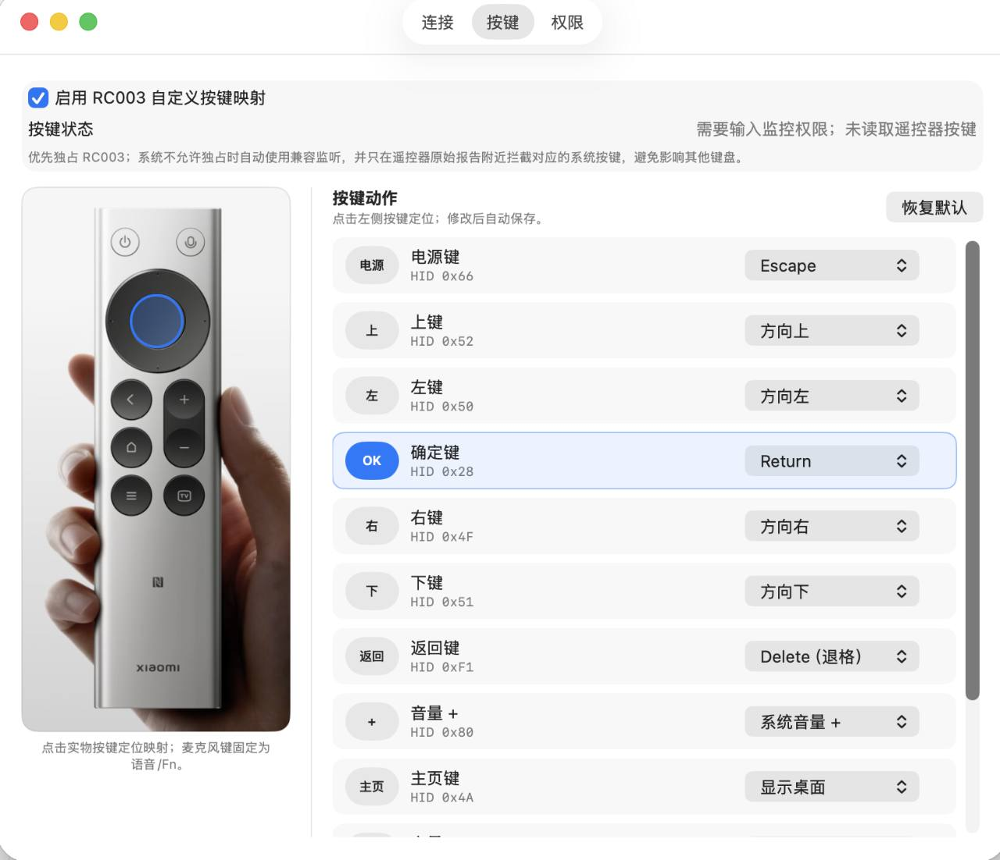

# 小米 RC003 遥控器桥接使用说明

本文面向直接使用“小米遥控器桥接”的 macOS 用户，介绍安装、授权、语音输入、按键配置和故障排查。

## 1. 使用前准备

你需要准备：

- macOS 11 Big Sur 或以上版本；
- 小米蓝牙遥控器 2 Pro / RC003；
- “小米遥控器桥接”App；
- 使用遥控器语音时，需要安装 `BlackHole 2ch` 或同类 CoreAudio 回环设备；
- 一个支持选择麦克风并能通过 Fn/地球键启动语音输入的输入法。

正式版和旁装测试版只能运行一个。两个 App 同时运行会争用同一台 RC003，导致按键或语音行为不稳定。

## 2. 安装 App

1. 把 App 放入 `/Applications`。
2. 在“应用程序”中按住 Control 单击 App，选择“打开”。
3. macOS 拦截启动时，打开“系统设置 → 隐私与安全性”，在安全性区域选择“仍要打开”。
4. 启动后，App 会显示在菜单栏中。

当前可能使用以下任一版本：

- 正式 App：`/Applications/小米遥控器桥接.app`
- 旁装测试 App：`/Applications/小米遥控器桥接-快捷键测试.app`

旁装测试 App 使用临时签名。重新构建或替换 App 后，macOS 可能要求重新授予“输入监控”和“辅助功能”权限。

## 3. 配对 RC003

1. 打开“系统设置 → 蓝牙”。
2. 同时长按遥控器的主页键和菜单键，使遥控器进入配对状态。
3. 在蓝牙设备列表中连接以下名称之一：
   - 小米蓝牙语音遥控器
   - MI RC
   - Xiaomi Bluetooth Remote 2 Pro
4. 打开菜单栏中的桥接 App。
5. App 没有自动连接时，选择“立即重新连接”。

## 4. 授予系统权限

打开菜单栏 App，进入“打开设置 → 权限”。

### 蓝牙

蓝牙权限用于连接 RC003 和接收遥控器语音。首次启动出现系统提示时选择“允许”。

### 输入监控

输入监控用于读取 RC003 的原始按键报告，并阻止 TV 键等按键继续向 macOS 发送原始字符。

1. 点击“输入监控”旁的“请求权限”。
2. 在“系统设置 → 隐私与安全性 → 输入监控”中启用当前 App。

### 辅助功能

辅助功能用于向 Codex、终端和其他前台 App 发送映射后的快捷键。

1. 点击“辅助功能”旁的“请求权限”。
2. 在“系统设置 → 隐私与安全性 → 辅助功能”中启用当前 App。

完成授权后，从菜单栏退出 App，再从“应用程序”重新打开。设置页中的“按键状态”应显示 RC003 已连接，不应继续显示“需要输入监控权限”或“需要辅助功能权限”。

### 权限开关已打开，App 仍提示未授权

这通常发生在旁装测试 App 被重新构建后。旧权限记录仍指向上一个二进制文件。

1. 完全退出桥接 App。
2. 在“输入监控”和“辅助功能”中删除旧的 App 条目。
3. 点击列表下方的 `+`，重新选择当前 `/Applications` 中的 App。
4. 打开两个权限。
5. 重新启动 App。

## 5. 配置 BlackHole 语音链路

### 安装 BlackHole 2ch

已安装 Homebrew 时可以执行：

```bash
brew install blackhole-2ch
```

也可以从 [BlackHole 官方网站](https://existential.audio/blackhole/)下载安装。

### 选择语音输出

1. 打开桥接 App 的“设置 → 连接”。
2. 在“虚拟麦克风 → 语音输出”中选择 `BlackHole 2ch`。
3. 点击“发送 1 秒测试音”，确认 App 能写入该设备。
4. 在目标输入法的麦克风设置中选择同一个 `BlackHole 2ch`。

桥接 App 的语音输出和输入法的麦克风必须选择同一个设备。macOS 的系统声音输出继续使用扬声器或耳机，不要改成 `BlackHole 2ch`，否则你可能听不到系统声音。

### BlackHole 没有出现在设备列表中

1. 打开“音频 MIDI 设置”，确认左侧存在 `BlackHole 2ch`。
2. 关闭正在使用音频的 App，再重新打开桥接 App。
3. 仍未出现时重启 Mac，然后再次检查“音频 MIDI 设置”。

## 6. 使用遥控器语音输入

1. 打开需要输入文字的 App。
2. 单击目标输入框，确认文字光标已经出现。
3. 按住 RC003 的麦克风键说话。
4. App 会把遥控器语音送入 `BlackHole 2ch`，同时把 RC003 的语音键映射为 Mac 的 Fn/地球键。
5. 松开麦克风键，App 会结束语音流并释放 Fn/地球键。

麦克风键属于固定核心功能，不能在普通按键列表中修改。

## 7. 理解三套按键配置

App 会根据前台应用自动选择一套配置：

- **Codex**：前台应用是 Codex；
- **Claude Code**：前台应用是设置中勾选的终端或编辑器；
- **通用**：其他应用。

Claude Code 默认识别 Ghostty 和 Warp。你可以在“设置 → 按键 → Claude Code”中勾选 Terminal、Ghostty、Warp、iTerm、Visual Studio Code 或 Cursor。

每套配置独立保存。在“通用”中修改 TV 键，不会修改“Codex”或“Claude Code”中的 TV 键。编辑映射前，应先在设置页顶部选择目标配置。

## 8. 单击、长按和连发

- 没有长按动作时，单击动作在按下时执行。
- 方向键、返回键和音量键使用预置动作且没有长按动作时，按住可以连发。
- 配置了长按动作后，1 秒内松开执行单击；按满 1 秒执行一次长按动作。
- 自定义快捷键只执行一次，不连发。
- 执行长按动作后，松开按键不会再执行单击动作。

## 9. 修改和录制按键



1. 打开“设置 → 按键”。
2. 打开“启用 RC003 自定义按键映射”。
3. 在顶部选择“通用”、“Codex”或“Claude Code”。
4. 点击左侧遥控器图片中的实体键，右侧会定位到对应条目。
5. 分别修改“单击”和“长按”。
6. 使用下拉菜单选择预置动作，或点击键盘图标录制自定义快捷键。
7. 录制时按下一个普通键，或按下带 `Control`、`Option`、`Shift`、`Command` 的组合键。
8. 按 `Esc` 取消录制，原绑定保持不变。

`Command-Tab`、`Command-Space` 等系统快捷键可能被 macOS 提前接管。`Command-Tab` 请直接选择“应用切换”预置动作。

“恢复默认”只恢复当前选中的配置，不影响另外两套配置。

## 10. 默认按键说明

下面的表格同时列出实际快捷键和用途。目标 App 更新快捷键后，默认用途可能变化，此时可以通过录制功能重新绑定。

### 通用配置

| RC003 按键 | 单击快捷键 | 单击作用 | 长按作用 |
| --- | --- | --- | --- |
| 麦克风 | 固定 Fn/地球键 + 语音流 | 启动输入法语音输入 | 松开后结束语音输入 |
| 电源 | `Escape` | 取消、关闭菜单或返回上一级 | 无 |
| 上 / 下 / 左 / 右 | 对应方向键 | 移动选择或光标 | 按住连发 |
| OK | `Return` | 确认或换行 | 无 |
| 返回 | `Delete` | 删除前一个字符 | `Command-Delete`，删除到行首；光标在行尾时可清空当前行 |
| 音量 + | 系统音量增加 | 增加系统音量 | 按住连发 |
| 音量 - | 系统音量降低 | 降低系统音量 | 按住连发 |
| 主页 | `Fn-F11` | 显示桌面 | 无 |
| 菜单 | `Shift-F10` | 打开右键菜单 | 无 |
| TV | `Command-Tab` | 切换应用 | 无 |

### Codex 配置

| RC003 按键 | 单击快捷键与作用 | 长按快捷键与作用 |
| --- | --- | --- |
| 麦克风 | 固定 Fn/地球键并发送语音，启动输入法语音输入 | 松开后结束语音输入 |
| 电源 | `Escape`，取消当前操作 | 无 |
| 上 / 下 / 左 / 右 | 对应方向键，移动会话、菜单或文本光标 | 按住连发 |
| OK | `Return`，确认选择或发送 | 无 |
| 返回 | `Delete`，删除前一个字符 | `Command-Delete`，删除到行首；光标在行尾时可清空当前行 |
| 音量 + | `Shift-Command-[`，切换到上一个会话 | `Command-[`，后退 |
| 音量 - | `Shift-Command-]`，切换到下一个会话 | `Command-]`，前进 |
| 主页 | `Command-N`，新建会话 | `Shift-Command-P`，打开命令菜单 |
| 菜单 | `Control-Shift-G`，打开审查 | `Option-Command-B`，切换审查面板 |
| TV | `Command-G`，搜索会话 | `Control-Tab`，切换最近会话 |

Codex 的常用流程：按 TV 搜索会话，使用上下键选择，按 OK 确认；输入文字时使用返回键删除，长按返回键删除整行。

### Claude Code 配置

| RC003 按键 | 单击快捷键与作用 | 长按快捷键与作用 |
| --- | --- | --- |
| 麦克风 | 固定 Fn/地球键并发送语音，启动输入法语音输入 | 松开后结束语音输入 |
| 电源 | `Escape`，取消当前操作 | 无 |
| 上 / 下 / 左 / 右 | 对应方向键，移动选择或文本光标 | 按住连发 |
| OK | `Return`，确认或发送 | `Control-J`，插入换行 |
| 返回 | `Delete`，删除前一个字符 | `Control-U`，清除当前输入行 |
| 音量 + | `Control-R`，搜索命令历史 | `Control-B`，切换后台运行 |
| 音量 - | `Control-T`，打开任务清单 | `Control-S`，暂存当前输入 |
| 主页 | `Control-C`，中断当前操作 | `Option-O`，切换快速模式 |
| 菜单 | `Shift-Tab`，切换权限模式 | `Option-T`，切换思考模式 |
| TV | `Control-O`，查看详细记录 | `Option-P`，选择模型 |

## 11. 常见问题

### TV 键只输入反引号

RC003 的 TV 键会被 macOS 原生识别为反引号键。桥接 App 取得输入监控权限后会拦截这个原始字符，再发送配置中的动作。

出现反引号时检查：

1. “启用 RC003 自定义按键映射”是否打开；
2. “输入监控”和“辅助功能”是否都授权给当前 App；
3. 正式版和旁装测试版是否同时运行；
4. 旁装测试 App 是否在授权后又被重新构建或替换。

权限记录失效时，按第 4 节的方法删除旧条目并重新加入当前 App。

### TV 键设置为一个快捷键，实际执行另一个快捷键

检查当前前台应用使用的配置。Codex 会自动使用“Codex”配置，选中的终端和编辑器会使用“Claude Code”配置，其他应用使用“通用”配置。

例如，你在“通用”中把 TV 改成 `Command-]`，在 Codex 中按 TV 时仍会执行“Codex”配置里的 `Command-G`。

### 长按返回有效，TV 键仍不符合设置

三套配置的长按返回可能拥有相同默认值，所以长按返回正常不能证明 TV 键使用了你正在查看的配置。切换到当前前台应用对应的配置，再检查 TV 的单击和长按。

### 按键完全没有映射动作

1. 打开“设置 → 按键”，查看“按键状态”。
2. 确认自定义按键映射已启用。
3. 检查输入监控和辅助功能。
4. 完全退出并重新启动 App。
5. 选择“立即重新连接”。

### 遥控器语音没有进入输入法

1. 确认桥接 App 已连接 RC003。
2. 确认桥接 App 的语音输出是 `BlackHole 2ch`。
3. 确认输入法的麦克风也是 `BlackHole 2ch`。
4. 点击“发送 1 秒测试音”检查音频链路。
5. 单击目标输入框，确认光标出现后再按住麦克风键。

### 输入法只显示语音预览，不能写入输入框

重新单击目标输入框，确认它可以编辑。实体键盘上的 Fn/地球键也无法直接写入时，应检查输入法的语音写入权限和当前输入框状态。

### 自定义快捷键无法录制

macOS 可能提前接管系统级快捷键。可以改用预置动作，或录制一个不会被系统占用的组合键。

## 12. 查看日志

打开“设置 → 权限”，点击“在 Finder 中显示日志”。日志文件位于：

```text
~/Library/Logs/XiaomiRemoteBridgeMac/runtime.log
```

排查按键时重点查看：

- `HID PERMISSIONS`：输入监控和辅助功能状态；
- `HID CONNECTED`：RC003 按键设备是否连接；
- `HID BUTTON down`：识别到的实体按键、当前配置和单击/长按绑定；
- `HID BUTTON short` / `HID BUTTON hold`：实际发送的动作；
- `ATVV STREAM START` / `ATVV STREAM STOP`：遥控器语音是否开始和结束。

日志不记录语音内容、蓝牙地址或外设 UUID。

## 13. 恢复默认和升级

### 恢复默认

1. 打开“设置 → 按键”。
2. 选择需要恢复的配置。
3. 点击“恢复默认”。
4. 对另外两套配置重复操作，才能恢复全部默认映射。

### 替换或升级 App

- 完全退出旧 App 后再替换文件。
- 保持 App 名称、安装路径和签名身份稳定，可以减少重复授权。
- 旁装测试 App 使用临时签名，重新构建后通常需要重新添加输入监控和辅助功能权限。
- 降级到旧版前先恢复默认。新版自定义快捷键配置可能无法被旧版读取。

## 14. 隐私说明

- App 不上传语音，也不保存语音文件。
- 解码后的音频只在内存和用户选择的音频设备之间流动。
- App 不自动修改 macOS 的系统默认输入或输出设备。
- App 不保存真实蓝牙地址。
- 权限不足或设备身份不匹配时，App 会停止按键映射。
